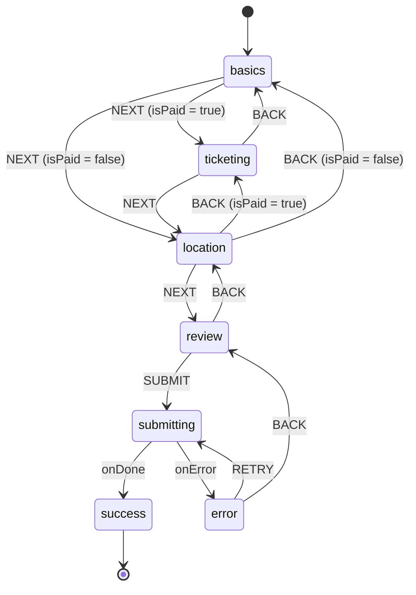

# Event State Machine Documentation

The `EventWizard` component uses an XState finite state machine (`eventCreationMachine`) to manage its complex multi-step UI flow.

## State Chart



## Context Schema

```ts
export interface EventContext {
  formData: {
    title: string;
    description: string;
    category: string;
    isPaid: boolean;
    price?: number;
    currency?: string;
    location?: string;
    startDate: string;
    endDate: string;
    tags: string[];
    image?: string;
  };
  validationErrors: Record<string, string>;
  currentStep: number;
}
```

## Guards

- `isBasicsValid`: Verifies all required fields in the basics step are filled.
- `isTicketingValid`: Ensures price > 0 and currency is selected for paid events.
- `isLocationValid`: Ensures a location string exists.
- `isPaidEvent` / `isFreeEvent`: Checks `context.formData.isPaid`.
- `canSubmit`: Runs full validation across all fields before allowing submission.

## Persistence

The `useEventWizard` hook automatically saves the `snapshot.value` and `snapshot.context` to `sessionStorage` after every transition (except `success`).
Upon mount, it attempts to load from `sessionStorage` and restores context using the `RESTORE` event.
